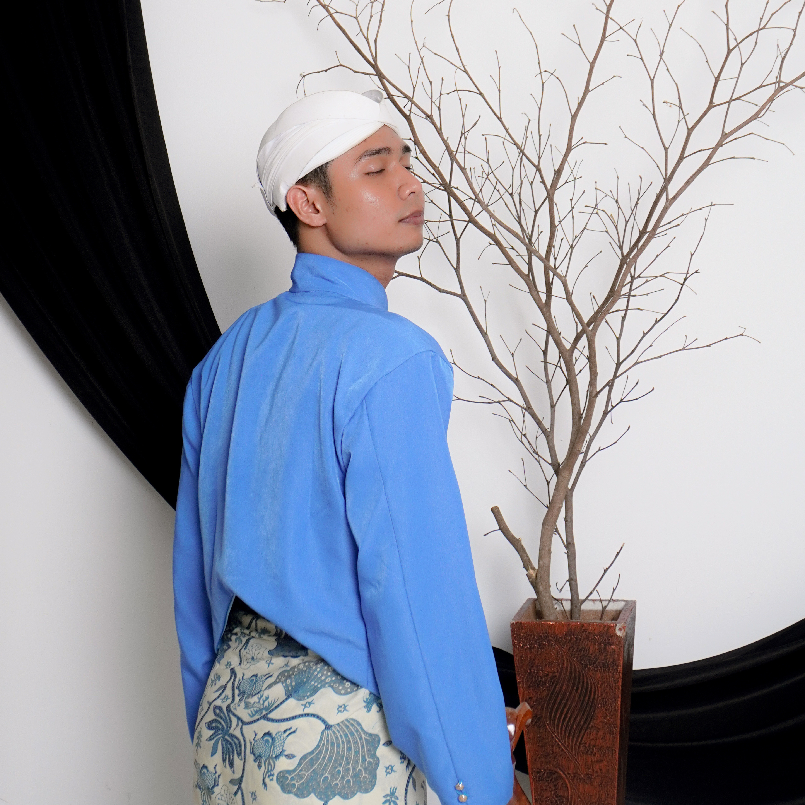

<!DOCTYPE html>
<html lang="id" class="scroll-smooth">
<head>
    <meta charset="UTF-8">
    <meta name="viewport" content="width=device-width, initial-scale=1.0">
    <title>Undangan Pernikahan - Amar & Elsa</title>
    <!-- Tailwind CSS -->
    
    <!-- Font Elegan Google Fonts -->
    <link rel="preconnect" href="https://fonts.googleapis.com">
    <link rel="preconnect" href="https://fonts.gstatic.com" crossorigin>
    <link href="https://fonts.googleapis.com/css2?family=Playfair+Display:ital,wght@0,400..900;1,400..900&family=Plus+Jakarta+Sans:wght@300;400;500;600;700&family=Sacramento&display=swap" rel="stylesheet">
    <!-- FontAwesome Icons -->
    <link rel="stylesheet" href="https://cdnjs.cloudflare.com/ajax/libs/font-awesome/6.4.0/css/all.min.css">
    
    
</head>
<body class="bg-[#fcfbf7] text-stone-800">

    <!-- CANVAS UNTUK ANIMASI KELOPAK BUNGA GUGUR -->
    <canvas id="petals-canvas"></canvas>

    <!-- FLOATING MUSIC PLAYER BUTTON (Hanya aktif setelah undangan dibuka) -->
    

        <button onclick="toggleMusic()" class="bg-[#124e41] text-[#eadeca] p-4 rounded-full shadow-2xl flex items-center justify-center transition-all duration-300 hover:scale-110 active:scale-95 focus:outline-none">
            <i id="music-icon" class="fa-solid fa-compact-disc text-2xl animate-spin-slow"></i>
        </button>
        <!-- Background Audio (Piano Romantis Instrumental) -->
        <audio id="bg-audio" loop>
            <source src="Bruno Mars - Risk It All Lyrics.mp3" type="audio/mp3">
        </audio>
    

    <!-- ENVELOPE / OPENING COVER COVER OVERLAY -->
    

        <!-- Dekorasi Ornamen Latar -->
        

        

        

            
The Wedding Celebration of

            <h1 class="font-handwritten text-7xl md:text-8xl text-amber-100 my-2">Amar & Elsa</h1>
            
Kepada Yth. Bapak/Ibu/Saudara/i

            
            

                Tamu Undangan
            

            
Tanpa mengurangi rasa hormat, kami mengundang Anda untuk hadir di hari bahagia kami.

            
            <button onclick="openUndangan()" class="mt-4 bg-gradient-to-r from-amber-200 to-amber-100 text-[#0d2a23] font-bold px-8 py-3.5 rounded-full shadow-lg hover:shadow-amber-200/20 transition-all duration-300 transform hover:-translate-y-1 active:translate-y-0 uppercase tracking-widest text-xs flex items-center gap-2">
                <i class="fa-solid fa-envelope-open-text text-sm"></i> Buka Undangan
            </button>
        

    

    <!-- MAIN CONTENT (Sembunyi sebelum dibuka agar transisi mulus) -->
    

        <!-- HERO SECTION -->
        <section class="relative min-h-screen flex flex-col justify-center items-center text-center px-6 overflow-hidden">
            <!-- Background Image dengan Animasi Pembesaran Lambat -->
            

            

            

                

                    Menuju Hari Bahagia
                

                <h1 class="font-handwritten text-8xl md:text-9xl text-amber-100">Amar & Elsa</h1>
                

                    Kami mengundang Anda untuk merayakan babak baru dalam perjalanan cinta kami.
                

                <!-- COUNTDOWN TIMER -->
                

                    

                        00
                        Hari
                    

                    

                        00
                        Jam
                    

                    

                        00
                        Menit
                    

                    

                        00
                        Detik
                    

                

                

                    <a href="#mempelai" class="text-xs uppercase tracking-widest text-amber-100/70 hover:text-amber-100 transition-colors flex flex-col items-center gap-2">
                        Scroll Kebawah
                        <i class="fa-solid fa-chevron-down animate-bounce text-sm"></i>
                    </a>
                

            

        </section>

        <!-- AYAT SUCI / MUKADIMAH SECTION -->
        <section class="max-w-4xl mx-auto px-6 py-24 text-center reveal">
            

                <i class="fa-solid fa-leaf"></i>
            

            

                "Dan di antara tanda-tanda kekuasaan-Nya ialah Dia menciptakan untukmu isteri-isteri dari jenismu sendiri, supaya kamu cenderung dan merasa tenteram kepadanya, dan dijadikan-Nya diantaramu rasa kasih dan sayang. Sesungguhnya pada yang demikian itu benar-benar terdapat tanda-tanda bagi kaum yang berfikir."
            

            
Ar-Rum: 21

        </section>

        <!-- MEMPELAI SECTION -->
        <section id="mempelai" class="bg-gradient-to-b from-[#fcfbf7] to-[#f4f2ea] py-24 px-6">
            

                
                

                    <h2 class="font-serif-wedding text-4xl md:text-5xl text-[#124e41]">Profil Mempelai</h2>
                    
Dengan memohon ridho Tuhan, perkenalkan kami:

                

                

                    <!-- Groom -->
                    

                        

                            <!-- Placeholder atau foto mempelai -->
                            
                        

                        

                            <h3 class="font-serif-wedding text-2xl font-bold text-stone-800">Muammar Hanafi</h3>
                            
Mempelai Pria

                            

                                Putra Pertama dari Bapak Danuri   & Ibu Ningsih
                            

                        

                        

                            <a href="https://www.instagram.com/hanafimuammar06?utm_source=ig_web_button_share_sheet&igsh=ZDNlZDc0MzIxNw==" class="text-stone-400 hover:text-amber-700"><i class="fa-brands fa-instagram text-xl"></i></a>
                        

                    

                    <!-- Bride -->
                    

                        

                            
                        

                        

                            <h3 class="font-serif-wedding text-2xl font-bold text-stone-800">Elsa julyana</h3>
                            
Mempelai Wanita

                            

                                Putri ke dua dari Bapak Suherman   & Ibu Entin Santinah
                            

                        

                        

                            <a href="https://www.instagram.com/ecajlyna_?utm_source=ig_web_button_share_sheet&igsh=ZDNlZDc0MzIxNw==" class="text-stone-400 hover:text-amber-700"><i class="fa-brands fa-instagram text-xl"></i></a>
                        

                    

                

            

        </section>

        <!-- ACARA SECTION -->
        <section id="acara" class="py-24 px-6 bg-[#0d2a23] text-[#eadeca]">
            

                
                

                    <h2 class="font-serif-wedding text-4xl md:text-5xl text-amber-100">Waktu & Tempat Acara</h2>
                    
Rangkaian acara pernikahan kami

                

                

                    <!-- Akad Nikah -->
                    

                        

                            <i class="fa-solid fa-ring"></i> Akad Nikah
                        

                        

                            
Senin, 29 Juni 2026

                            
Pukul 08.00 - 10.00 WIB

                        

                        

                        

                            
Kp. Tugu Kaum

                            
Bogor RT 02/RW 05 Desa Cibitung Tengah Kecamatan Tenjolaya Kabupaten Bogor

                        

                    

                    <!-- Resepsi -->
                    

                        

                            <i class="fa-solid fa-champagne-glasses"></i> Resepsi Pernikahan
                        

                        

                            
Senin, 29 Juni 2026

                            
Pukul 11.00 WIB S/d Selesai 

                        

                        

                        

                            
Kp. Tugu Kaum

                            
Bogor RT 02/RW 05 Desa Cibitung Tengah Kecamatan Tenjolaya Kabupaten Bogor

                        

                    

                

                <!-- Google Maps Button -->
                

                    <a href="https://maps.app.goo.gl/1yGhWpyoJQQuyjcb7" target="_blank" class="inline-flex items-center gap-2 bg-gradient-to-r from-amber-200 to-amber-100 hover:from-amber-300 hover:to-amber-200 text-[#0d2a23] text-xs font-bold uppercase tracking-widest px-6 py-3.5 rounded-full shadow-lg transition-transform hover:-translate-y-0.5 active:translate-y-0">
                        <i class="fa-solid fa-map-location-dot"></i> Buka Google Maps Lokasi
                    </a>
                

            

        </section>

        <!-- GALERI FOTO EXQUISITE -->
        <section class="py-24 px-6 bg-[#fcfbf7] reveal">
            

                

                    <h2 class="font-serif-wedding text-4xl md:text-5xl text-[#124e41]">Momen Bahagia Kami</h2>
                    
Galeri Prewedding

                

                <!-- Highlight Frame featuring the supplied image: 17559407200351290105.jpeg -->
                

                    
                    

                        
Menanti hari pernikahan yang indah bersama Anda...

                    

                

            

        </section>

        <!-- KADO DIGITAL / WEDDING GIFT -->
        <section class="py-24 px-6 bg-gradient-to-b from-[#fcfbf7] to-[#f4f2ea]">
            

                
                

                    <h2 class="font-serif-wedding text-4xl md:text-5xl text-[#124e41]">Kado Digital</h2>
                    
Doa restu Anda adalah berkah paling berharga, namun jika ingin berbagi kado:

                

                

                    <!-- Bank Account Card 1 -->
                    

                        

                            DANA
                        

                        

                            
No. Dana

                            
089517283688

                        

                        
a.n. Muammar Hanafi

                        <button onclick="copyToClipboard('123-00-112233-4', 'btn-copy-1')" id="btn-copy-1" class="text-xs text-amber-700 font-bold hover:text-amber-800 transition-colors uppercase tracking-wider flex items-center justify-center gap-1 mx-auto border border-amber-700/20 px-3 py-1.5 rounded-full">
                            <i class="fa-solid fa-copy"></i> Salin Rekening
                        </button>
                    

                    <!-- Bank Account Card 2 -->
                    

                        

                            BANK BCA
                        

                        

                            
No. Rekening

                            
7080630365

                        

                        
a.n. Elsa Julyana

                        <button onclick="copyToClipboard('890-1234-567', 'btn-copy-2')" id="btn-copy-2" class="text-xs text-amber-700 font-bold hover:text-amber-800 transition-colors uppercase tracking-wider flex items-center justify-center gap-1 mx-auto border border-amber-700/20 px-3 py-1.5 rounded-full">
                            <i class="fa-solid fa-copy"></i> Salin Rekening
                        </button>
                    

                

            

        </section>

        <!-- RSVP & WISH WALL (BUKU TAMU INTERAKTIF) -->
        <section id="rsvp" class="py-24 px-6 bg-gradient-to-b from-[#f4f2ea] to-[#eadeca]">
            

                
                <!-- RSVP Form Block -->
                

                    

                        <h2 class="font-serif-wedding text-3xl text-[#124e41]">Kehadiran & Doa</h2>
                        
Mohon konfirmasi kehadiran Anda

                    

                    <form id="rsvp-form" class="space-y-4 text-stone-700">
                        

                            <label class="block text-xs font-semibold uppercase tracking-widest text-stone-500 mb-1">Nama Lengkap</label>
                            <input type="text" id="form-name" required placeholder="Masukkan nama Anda" class="w-full px-4 py-3 border border-stone-200 rounded-xl focus:outline-none focus:ring-2 focus:ring-[#124e41] bg-white/70">
                        

                        

                            <label class="block text-xs font-semibold uppercase tracking-widest text-stone-500 mb-1">Status Kehadiran</label>
                            <select id="form-presence" required class="w-full px-4 py-3 border border-stone-200 rounded-xl focus:outline-none focus:ring-2 focus:ring-[#124e41] bg-white/70">
                                <option value="Hadir">Saya Akan Hadir</option>
                                <option value="Tidak Hadir">Maaf, Tidak Bisa Hadir</option>
                                <option value="Ragu-Ragu">Masih Ragu-Ragu</option>
                            </select>
                        

                        

                            <label class="block text-xs font-semibold uppercase tracking-widest text-stone-500 mb-1">Pesan / Ucapan Selamat</label>
                            <textarea id="form-message" required rows="4" placeholder="Tulis ucapan dan doa hangat Anda..." class="w-full px-4 py-3 border border-stone-200 rounded-xl focus:outline-none focus:ring-2 focus:ring-[#124e41] bg-white/70"></textarea>
                        

                        <button type="submit" class="w-full bg-[#124e41] hover:bg-[#0d2a23] text-white font-bold py-3.5 rounded-xl transition-all shadow-lg text-xs uppercase tracking-widest flex items-center justify-center gap-2">
                            <i class="fa-solid fa-paper-plane"></i> Kirim Ucapan
                        </button>
                    </form>
                

                <!-- Wish Wall / Dinding Harapan (Real-time update via script) -->
                

                    

                        <h2 class="font-serif-wedding text-3xl text-[#124e41] flex items-center gap-2">
                            <i class="fa-solid fa-comments"></i> Dinding Harapan
                        </h2>
                        
Doa & Ucapan hangat dari para sahabat & keluarga

                    

                    <!-- Scrollable Wall Container -->
                    

                        <!-- Wishes will populate dynamically here -->
                        

                            

                                S
                            

                            

                                

                                    Sarah Wijaya
                                    Hadir
                                

                                
Selamat menempuh hidup baru Amar & Elsa! Semoga menjadi keluarga yang sakinah, mawaddah, warahmah.

                                2 jam yang lalu
                            

                        

                        

                            

                                B
                            

                            

                                

                                    Budi Santoso
                                    Hadir
                                

                                
Selamat bahagia ya kawan! Maaf belum bisa hadir langsung, doa terbaik dari jauh untuk kebahagiaan kalian berdua.

                                4 jam yang lalu
                            

                        

                    

                

            

        </section>

        <!-- OUTRO SECTION -->
        <section class="py-24 px-6 bg-[#0d2a23] text-center text-[#eadeca] relative overflow-hidden">
            

            

                
Merupakan Suatu Kehormatan

                <h2 class="font-handwritten text-7xl text-amber-100">Terima Kasih</h2>
                

                    Atas kehadiran serta doa restu yang Anda berikan kepada kami berdua di hari pernikahan ini.
                

                

                    
Amar & Elsa

                

            

        </section>

        <!-- FOOTER -->
        <footer class="bg-[#081d18] text-[#eadeca]/40 py-8 text-center text-xs tracking-widest uppercase">
            
© 2026 Amar & Elsa Wedding. All Rights Reserved.

        </footer>

    

    <!-- JAVASCRIPT & LOGIKA ANIMASI -->
    

    <!-- CSS khusus untuk animasi rsvp yang baru dikirim -->
    
</body>
</html>
